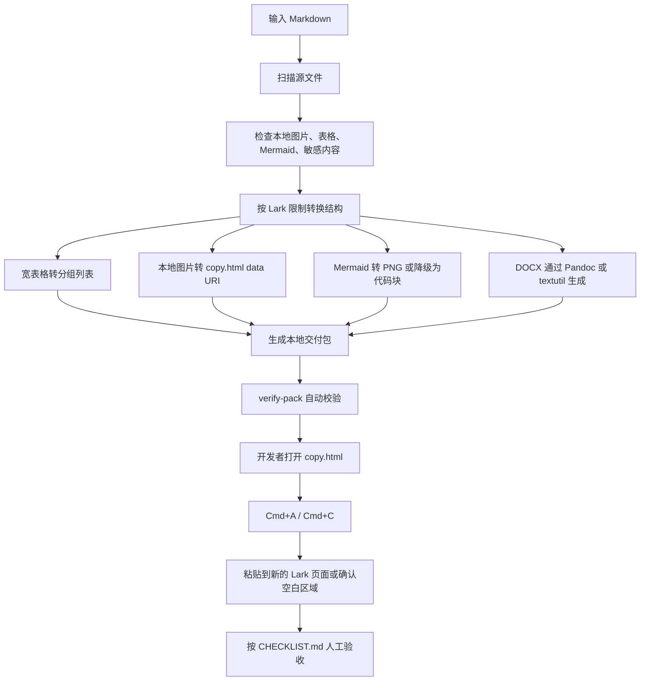

# Lark Paste Pack

`lark-paste-pack` 用于在没有 Lark 应用凭证时，把本地 Markdown 生成一套适合手动复制或导入 Lark 云文档的本地交付包。

它只负责生成和校验本地文件，不登录 Lark、不调用 Lark API、不安装 Lark MCP、不自动覆盖云文档。

## 适用场景

- 本地 Markdown 需要复制到 Lark 云文档。
- 文档里有本地图片、Mermaid、接口字段、API 路径、文件路径或宽表格。
- 没有 `LARK_APP_ID` / `LARK_APP_SECRET`，不能走 OpenAPI 或 MCP 自动写入。
- 希望先生成 `copy.html`、`copy.txt`、`import.docx`、`report` 和 `CHECKLIST.md`，再人工粘贴和验收。

## 链路图



## 依赖软件

必需：

- Node.js 18 或更高版本：运行 `scripts/build-lark-paste-pack.mjs` 和 `scripts/verify-pack.mjs`。
- npm：通过 `npm run build-pack`、`npm run verify-pack`、`npm test` 执行脚本。

推荐：

- Pandoc：生成质量更稳定的 `import.docx`。当前验收环境使用 `pandoc 3.10`。
- Mermaid CLI：把 Mermaid 渲染成 PNG。当前验收环境使用 `mmdc 11.16.0`。

macOS 兜底：

- `textutil`：当 Pandoc 不可用时，可生成 `import.docx` 兜底文件；使用 `textutil` 时，必须人工确认 Lark 导入后的图片效果。
- Google Chrome 或 Chromium：当 Mermaid CLI 没有自带浏览器时，脚本会尝试复用本机 Chrome 渲染 Mermaid。

检查命令：

```bash
command -v node
command -v npm
command -v pandoc
command -v mmdc
node -v
npm -v
pandoc -v | sed -n '1,3p'
mmdc --version
```

安装推荐依赖：

```bash
brew install pandoc
npm install -g @mermaid-js/mermaid-cli
```

## 输入与输出

输入：

```text
/path/to/source.md
```

默认输出目录：

```text
/tmp/lark-paste-pack/<source-basename>-<timestamp>/
```

输出文件：

- `00-source-scan.json`：源文件扫描结果。
- `01-normalized.md`：转换后的中间 Markdown。
- `copy.html`：富文本复制入口，用浏览器打开后 `Cmd+A` / `Cmd+C`。
- `copy.txt`：纯文本兜底。
- `import.docx`：Lark 导入用 DOCX，优先由 Pandoc 生成。
- `report.md`：给开发者看的转换报告。
- `report.json`：给脚本或 Codex 读取的结构化报告。
- `CHECKLIST.md`：粘贴到 Lark 后的人工验收清单。
- `assets/original/`：复制出的源图片。
- `assets/mermaid/`：Mermaid 源码和渲染后的图片。

## 常用命令

进入 skill 目录：

```bash
cd /Users/mac004/Desktop/ndgwww/agent-skills-storage/skills/lark-paste-pack
```

生成 Lark 粘贴包：

```bash
npm run build-pack -- \
  --source /Users/mac004/Desktop/ndgwww/tenant_portal/docs/Codex业务模块接入指南.md \
  --out /tmp/lark-paste-pack \
  --mode all \
  --docx optional
```

校验输出包：

```bash
npm run verify-pack -- --pack /tmp/lark-paste-pack/<generated-pack-dir>
```

校验 skill 本身：

```bash
npm test
```

或：

```bash
bash scripts/validate-skill.sh
```

## Lark 格式规则

表格：

- 默认不保留 Markdown 表格。
- 3 列及以上表格全部转成分组列表。
- 包含 API 路径、URL、字段名、文件路径、代码或长文本说明的表格全部转成分组列表。
- `copy.html` 默认不应包含 `<table>`。

图片：

- 本地图片必须能解析成功。
- `copy.html` 中图片使用 data URI，便于浏览器富文本复制。
- 缺图时构建失败，并写入 `report.json` 的 `errors` 和 `missingImages`。

Mermaid：

- 有 `mmdc` 时尝试渲染成 PNG。
- 没有 `mmdc` 或渲染失败时保留 Mermaid 代码块，并在报告中写 warning。
- 不依赖 Lark 原生 Mermaid block。

DOCX：

- 优先使用 Pandoc。
- macOS 可用 `textutil` 兜底。
- 如果使用 `textutil`，需要人工确认 Lark 导入后的图片效果。

安全：

- 检测真实 Bearer token、API Key、Secret、私钥和签名 URL。
- 允许 `<your-api-key>`、`$API_KEY`、`API_KEY` 等占位符。
- 不应把真实密钥写入报告或产物。

## 验收标准

源文件验收：

- Markdown 文件存在。
- 本地图片全部解析成功。
- 表格、图片、Mermaid 数量被写入 `report.json`。
- 未检测到真实密钥。

输出包验收：

- `copy.html`、`copy.txt`、`import.docx`、`report.md`、`report.json`、`CHECKLIST.md`、`00-source-scan.json`、`01-normalized.md` 均存在。
- `verify-pack` 通过。
- `copy.html` 中 `<table>` 数量为 `0`。
- 源图片全部进入 `assets/original/`。
- Mermaid 成功时进入 `assets/mermaid/diagram-*.png`。
- `report.md` / `report.json` 中 `warnings` 和 `errors` 符合预期。
- `copy.html`、`copy.txt`、`01-normalized.md` 中不应有 `file://`。

人工粘贴验收：

- 打开 `copy.html`。
- 按 `Cmd+A`。
- 按 `Cmd+C`。
- 粘贴到新的 Lark 页面或确认空白区域。
- 按 `CHECKLIST.md` 检查标题、图片、Mermaid、代码块和表格转列表区域。

## 禁止事项

- 不要把内容粘贴到已有 Lark 原生表格里。
- 不要逐格修 Lark 表格；发现布局异常应回到转换规则重建输出包。
- 不要使用此 skill 登录 Lark、调用 Lark API 或覆盖云文档。
- 不要把真实密钥、临时签名 URL、私钥或生产凭证写入示例、报告或 README。

## 安装到 Codex

从合集仓库安装：

```bash
npx skills@latest add ndgwww/agent-skills-storage -g -a codex -s lark-paste-pack -y --full-depth
```

安装后重启 Codex，让新的 skill 元数据生效。
