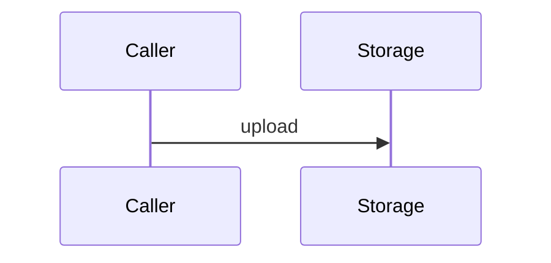

# Sample Lark Pack

This fixture verifies table conversion, image-free output, code blocks, and Mermaid fallback.

| Capability | Interface | Notes |
| --- | --- | --- |
| Upload | `POST /api/v1/drive/files/upload-r2` | Call `confirm-upload` after object upload. |
| Download | `GET /api/v1/drive/files/{file_id}/download-url` | Uses short-lived URLs. |



```bash
echo "ok"
```
